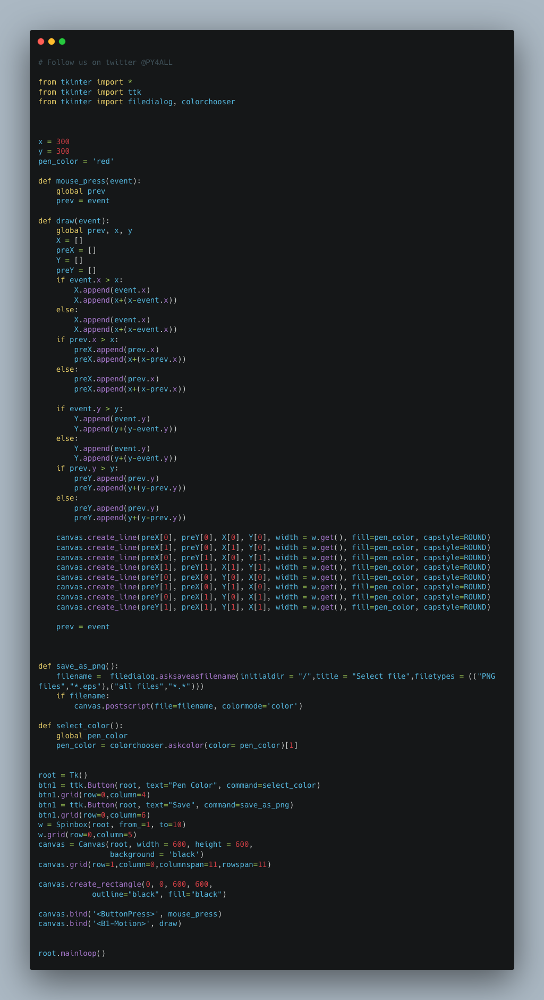
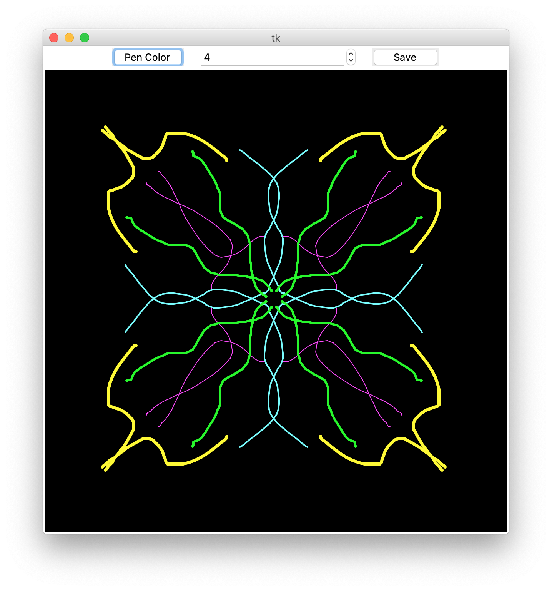

# DoodleDrawing
Doodle drawing using Python Tkinter Canvas



## This is a drawing application using python.

#### The modules Used to make this script are:-

        -tkinter

This is a GUI based python script.

## Install

Python Code On windows machine:

clone DoodleDrawing repository on local machine.
```

> git clone https://github.com/geosaleh/DoodleDrawing

```
change directory to DoodleDrawing
```

> cd DoodleDrawing/

```

Now its time to execute **DoodleDrawing.py**
```

> python DoodleDrawing.py

```
it will show following Output


## Download
:paperclip: [Download Here](https://github.com/geosaleh/DoodleDrawing/archive/refs/heads/main.zip)

Hope you'll install it in your computer just to try .


